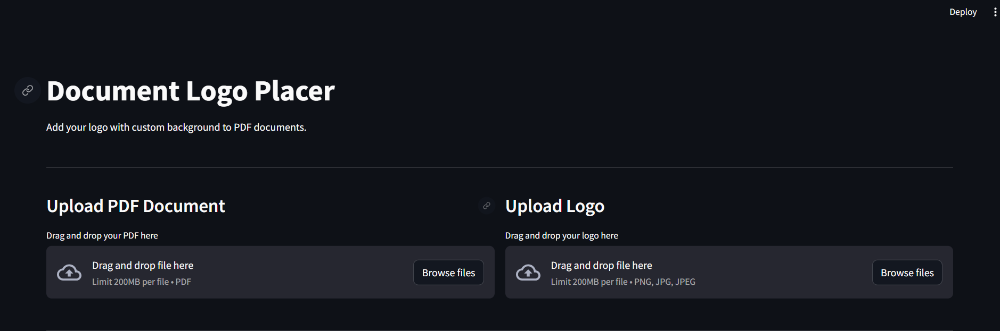
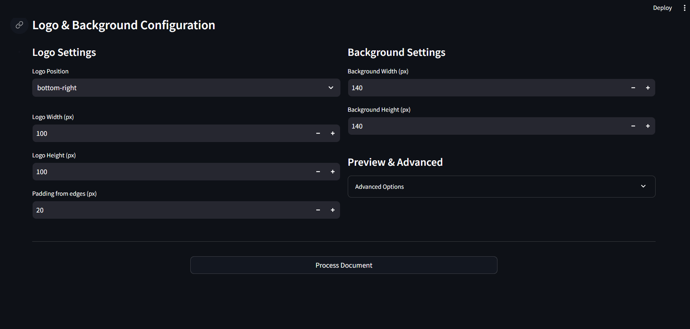

# Document Logo Placer

A user-friendly web application to add your own logo (with a customizable background) to PDF documents. Designed for both non-technical and technical users, it offers a simple drag-and-drop interface and advanced customization options.

---

## Features

- **Drag & Drop Simplicity:** Effortlessly upload your PDF and logo image.
- **Smart Logo Sizing:** Logo size defaults to maintain your image's aspect ratio.
- **Automatic Background Sizing:** The background adapts to your logo size and padding, but you can override it for full control.
- **Flexible Placement:** Choose from preset corners, center, or custom coordinates for your logo and background.
- **Fine-tune Everything:** Adjust logo width, height, rotation, background size, opacity, and padding.
- **Download Result:** Get your processed PDF with a single click.

---

## How It Works (Visual Guide)

### 1. Start the App
- Run the app and open it in your browser.

### 2. Upload Your Files
- **PDF Document:** Drag and drop or browse to select your PDF.
- **Logo Image:** Drag and drop or browse to select your logo (PNG/JPG recommended).



### 3. Configure Logo & Background
- **Logo Settings:**
  - Choose position (corners, center, or custom)
  - Adjust width/height (aspect ratio preserved by default)
  - Set padding from page edges
- **Background Settings:**
  - Background size auto-follows logo, or set your own
  - Adjust opacity and rotation in "Advanced Options"



### 4. Process & Download
- Click **Process Document**
- Download your new PDF with your logo and background perfectly placed

---

## Tech Stack
- **Frontend/UI:** [Streamlit](https://streamlit.io/) (Python)
- **PDF Processing:** [PyMuPDF](https://pymupdf.readthedocs.io/), [PyPDF2](https://pypdf2.readthedocs.io/)
- **Image Handling:** [Pillow (PIL)](https://python-pillow.org/), [NumPy](https://numpy.org/)
- **PDF Drawing:** [ReportLab](https://www.reportlab.com/)

---

## Installation

1. Clone this repository
2. Create a virtual environment (not strictly required, but recommended) :
   ```bash
   python -m venv venv
   source venv/bin/activate  # On Windows: venv\Scripts\activate
   ```
3. Install dependencies:
   ```bash
   pip install -r requirements.txt
   ```

---

## Usage

Run the application:
```bash
python src/main.py
```

Or, if you have a different entry point (recommended) :
```bash
streamlit run run.py
```

---

## Requirements
- Python 3.8 or higher
- See requirements.txt for Python package dependencies

---

## FAQ
- **What file types are supported?**
  - PDF for documents, PNG/JPG for logos.
- **Is my data private?**
  - All processing is local; your files never leave your computer.
- **Can I use this for batch processing?**
  - Currently, one document at a time. Batch support may be added in the future.

---

## Future Feature

- **Live Preview:** Instantly see your configuration before processing.

---

Open to issue report and suggestions, cheers!